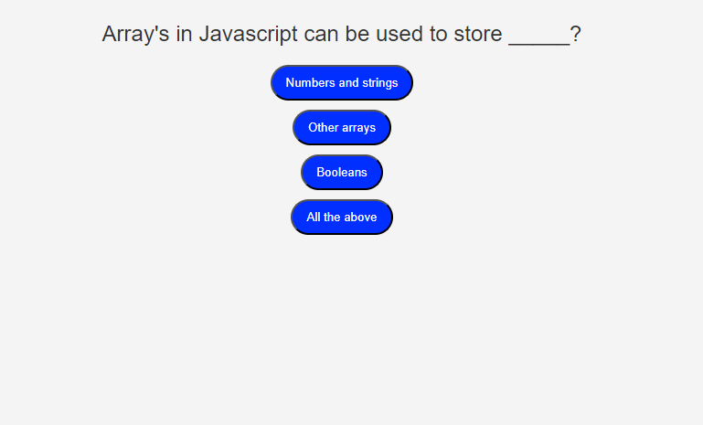
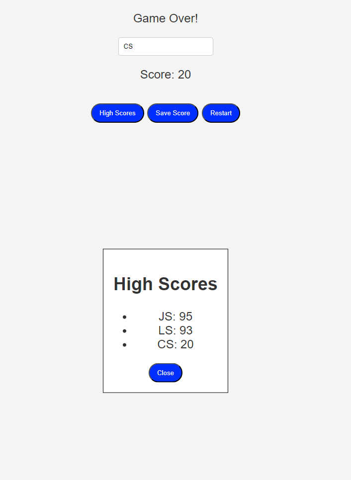

# Coding-Quiz

## Summary
The quiz game lets players answer multiple-choice questions within a timer. Correct answers earn points, while wrong answers reduce time. After all questions or when time runs out, the game ends. Players can view their score, see top scores, save their results, or restart the game. The challenge lies in answering accurately while managing time.

## Sreenshots

## Link
https://meerkat501.github.io/Coding-Quiz/

